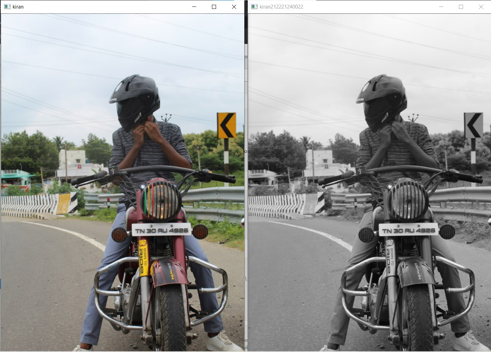
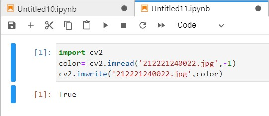
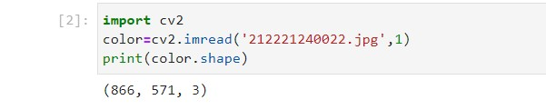
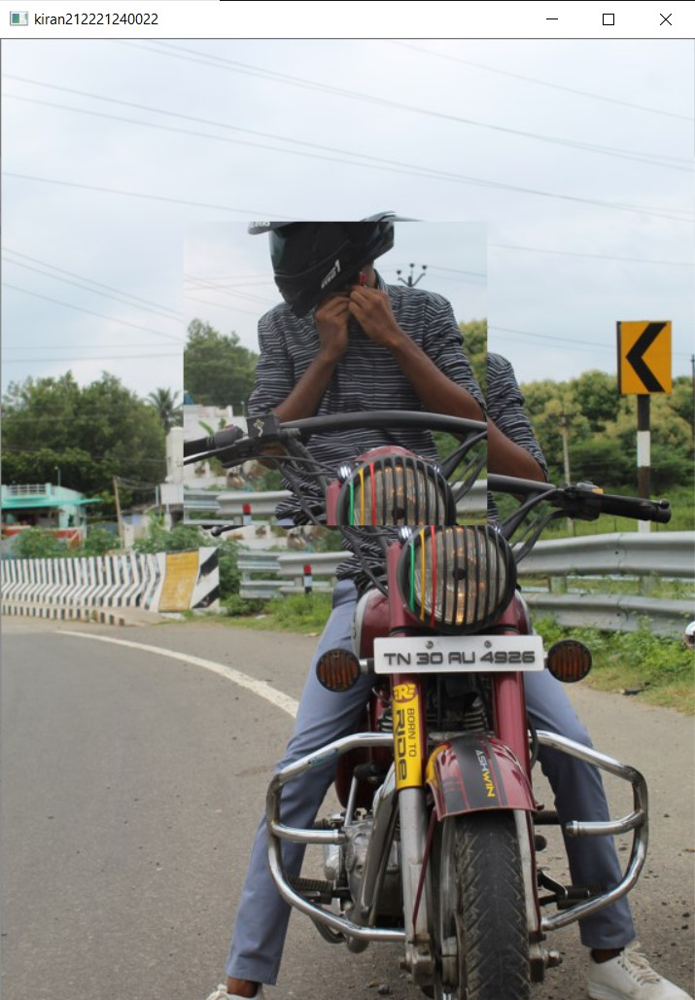

# READ AND WRITE AN IMAGE
## AIM
To write a python program using OpenCV to do the following image manipulations.
i) Read, display, and write an image.
ii) Access the rows and columns in an image.
iii) Cut and paste a small portion of the image.

## Software Required:
Anaconda - Python 3.7
## Algorithm:
### Step1:
Choose an image and save it as a filename.jpg
### Step2:
Use imread(filename, flags) to read the file.
### Step3:
Use imshow(window_name, image) to display the image.
### Step4:
Use imwrite(filename, image) to write the image.
### Step5:
End the program and close the output image windows.
## Program:
### Developed By:
### Register Number: 
i) #To Read,display the image
```python
import cv2
color_image = cv2.imread('212221240022.jpg',1)
#color_image = c2.imread('C:\Users\DELL\Desktop\212221240022.jpg',1)
grey_image = cv2.imread('212221240022.jpg',0)
cv2.imshow('kiran',color_image)
cv2.imshow('kiran212221240022',grey_image)
cv2.waitKey(0)
cv2.destroyAllWindows()

```
ii) #To write the image
```Python
import cv2
color= cv2.imread('212221240022.jpg',-1)
cv2.imwrite('212221240022.jpg',color)


```
iii) #Find the shape of the Image
```Python
import cv2
color=cv2.imread('212221240022.jpg',1)
print(color.shape)


```
iv) #To access rows and columns
```Python
import cv2
import random
img= cv2.imread('212221240022.jpg',-1)
for i in range(150):
    for j in range(img.shape[1]):
        img[i][j] = [random.randint(0,255),random.randint(0,255),random.randint(0,255)]
cv2.imshow('212221240022.jpg',img)
cv2.waitKey(0)


```
v) #To cut and paste portion of image
```Python
import cv2
img= cv2.imread('212221240022.jpg',-1)
new = img[200:450,200:450]
img[150:400,150:400] = new
cv2.imshow('kiran212221240022',img)
cv2.waitKey(0)


```

## Output:

### i) Read and display the image

<br> 
<br>

### ii)Write the image

<br>
<br>

### iii)Shape of the Image

<br>
<br>

### iv)Access rows and columns
<br>
<br>

### v)Cut and paste portion of image
<br>
<br>

## Result:
Thus the images are read, displayed, and written successfully using the python program.


